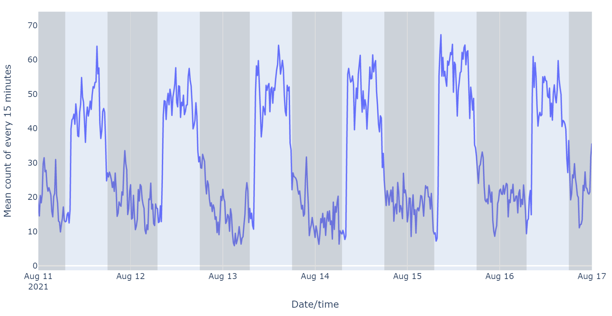

# Zebrafish Activity Monitor System
The system utilizes infrared (IR) sensors to measure the activity of zebrafish. It is designed to collect data on the movement and behavior of the fish in real-time, and use this information to provide insights into the health and well-being of the fish. The IR sensors are used to detect the movement of fish, which can be used as a proxy for activity levels. The system also uses machine learning algorithms or statistical models to process the data and generate predictions about future activity levels. The goal of the project is to provide a simple and reliable way to monitor zebrafish activity and to help researchers and facility managers understand and manage the health of the fish in their care.

## Activity levels were quantified by counting the number of IR beam breaks.

This is achieved by using a pair of IR emitter and receiver, with the emitter emitting a beam of infrared light and the receiver detecting the beam when it is interrupted by a fish passing between them. The system counts the number of times the IR beam is broken, which is used as a proxy for the level of fish activity in the area being monitored. The more IR beam breaks that are detected, the higher the level of fish activity. By quantifying the activity levels of fish in this way, the system provides a reliable and non-invasive way to gather data on the movement and behavior of the fish. In practice, there are four sets of IR emitters and receivers around a rearing container and the beam break counts of four sensors represent the overall activity level of all fish in the container.

## Example of activity data

The above plot shows the mean number of IR beam breaks at a 15-minutes frequency over a period of 6 days, which is used to indicate the activity levels of zebrafish. The data displayed in the plot exhibit a clear day-night cycle pattern, with the number of beam breaks fluctuating over time. The highest activity levels are shown as spikes in the data and occur during feeding time, suggesting that the fish are more active when they are being fed. The day-night cycle pattern can be explained by the natural behavior of the fish, which are more active during the day and rest at night (gray area). The plot provides a visual representation of the activity levels of the fish over time, which can be used to gain insights into their behavior and health.

### Interactive data viewer

## Exploratory data analysis
Toward developing models for forecasting activity, I performed ETS decomposition, data stationarity test, ACF and PACF to gain insights into the underlying structure of the data, which can inform the choice of forecasting models and improve the accuracy of the forecasts.
### Activity data decomposition (additive ETS decomposition)

From the above plot, the data exhibits a clear seasonal pattern or repeating pattern over a specific time interval (i.e., daily). The trend component slightly varied across the 6 days without a strong upward or downward long-term trend.   
### Data stationarity
**Augmented Dickey-Fuller test results**: Because the *p*-value is less than the significant level (0.05), the time series is stationary. As a result, there is no need to perform differencing on the time series when applying an ARIMA based model for forecasting.  

| description | value |
|---|---|
| test statistic | -4.34 |
| *p*-value | 0.000382 |
| # lag used | 1 |
| number of obs. | 575 |
| Critical value (1%) | -3.44 |
| Critical value (5%) | -2.87 |
| Critical value (10%)| -2.57 |

Note: ADF test null hypothesis: time series has a root unit and is non-stationary.

### ACF and PACF

ACF and PACF helps us to determine the order of MA component and the order of AR component in an ARIMA model. The results of ACF plot show the time series has a seasonal cycle at 96 lags and the correlation of data and its lagged version gradually converged, indicating the q term for an ARIMA model could be small, where as the PACF plot shows a significant drop at lag 2, indicating the p term for an ARIMA model could 1 or 2. Regardless, the optimal p and q terms of an ARIMA model can be determined using grid search and AIC scores.   

## Forecast future activity

### Split data into training and test sets

To develop forecasting models and evaluate model performance, I used a time-series cross-validation technique called "rolling window" by using 5 consecutive days as training data and the 6th day as test data.

Using a rolling window approach allows you to train and test the model on different parts of the data, which helps to reduce overfitting and improve the robustness of the model. The size of the window (i.e. 5 days) will impact the accuracy of the model, so it may be necessary to experiment with different window sizes to find the best results. Additionally, by using a rolling window approach, you can assess the model's performance over multiple time periods and assess its ability to generalize to future data.

### Forecast via SARIMA

### Forecast via SARIMAX

### Forecast via Prophet

### Forecast via LSTM

### Comparison of model performance

### Forecast into the future

## Conclusions
