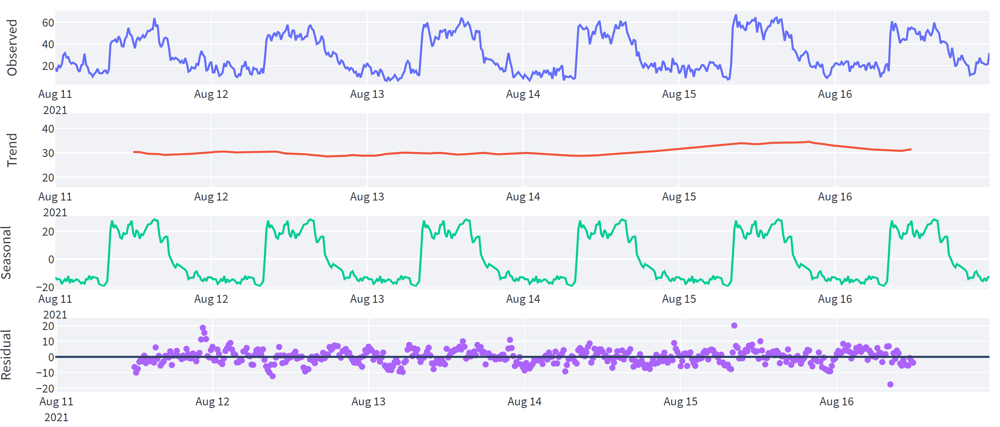

# Zebrafish Activity Monitor System
The system that utilizes infrared (IR) sensors to measure the activity of zebrafish. It is designed to collect data on the movement and behavior of the fish in real-time, and use this information to provide insights into the health and well-being of the fish. The IR sensors are used to detect the movement of individual fish, which can be used as a proxy for activity levels. The system may also machine learning algorithms or statistical models to process the data and generate predictions about future activity levels. The goal of the project is to provide a simple and reliable way to monitor zebrafish activity and to help researchers and facility managers understand and manage the health of the fish in their care.

## Activity levels were quantified by counting the number of IR beam breaks.

This is achieved by using a pair of IR emitter and receiver, with the emitter emitting a beam of infrared light and the receiver detecting the beam when it is interrupted by a fish passing between them. The system counts the number of times the IR beam is broken, which is used as a proxy for the level of fish activity in the area being monitored. The more IR beam breaks that are detected, the higher the level of fish activity. By quantifying the activity levels of fish in this way, the system provides a reliable and non-invasive way to gather data on the movement and behavior of the fish.

## Example of activity data

- Number of beam breaks per time unit represents the activity levels
- Resample data at a 15-minute frequency
- Mean count for every 15 minutes

### Interactive data viewer

### Activity data decomposition (additive ETS decomposition)

### Data stationarity

### ACF and PACF

## Predict future activity
